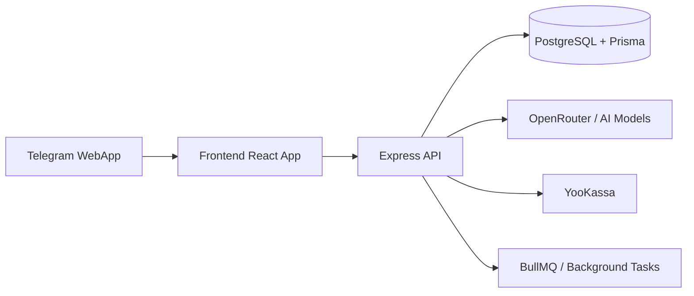

# SEOau

AI-платформа для генерации SEO/AIO-контента в формате Telegram WebApp: frontend на React + backend API на Express + PostgreSQL/Prisma.


## Содержание
- [О проекте](#о-проекте)
- [Ключевые возможности](#ключевые-возможности)
- [Основные функции приложения](#основные-функции-приложения)
- [Технологический стек](#технологический-стек)
- [Архитектура](#архитектура)
- [Структура репозитория](#структура-репозитория)
- [Быстрый старт](#быстрый-старт)
- [Скрипты](#скрипты)
- [Переменные окружения](#переменные-окружения)
- [API и документация](#api-и-документация)
- [Тестирование](#тестирование)
- [Дополнительная документация](#дополнительная-документация)
- [Безопасность](#безопасность)
- [Contributing](#contributing)
- [Лицензия](#лицензия)

## О проекте
SEOau автоматизирует производство контента и рабочих SEO-артефактов:
- генерация статей и текстовых блоков через AI;
- проверка релевантности, спамности и качества текста;
- ведение проектов и истории генераций;
- тарифная модель и платежная интеграция (YooKassa);
- работа в Telegram WebApp без отдельной формы регистрации.

## Ключевые возможности
- Telegram-auth и управление пользователями/планами.
- Генерация контента в обычном и streaming-режиме.
- История генераций и экспорт результатов.
- Knowledge Base и internal links workflow.
- Swagger/OpenAPI документация для backend API.
- Поддержка фоновых задач и очереди.

## Основные функции приложения
1. Авторизация и роли:
   Telegram WebApp авторизация, вход по `initData`, разделение прав пользователя и администратора.
2. Управление проектами:
   создание проектов, хранение конфигураций и истории генераций, фильтрация/пагинация истории.
3. Генерация SEO/AIO-контента:
   генерация статей в классическом и AIO-режиме, streaming-генерация, фоновые задачи через очередь.
4. Инструменты качества текста:
   проверка спамности, исправление переспама, повышение релевантности, SEO-аудит URL, рерайт, humanize.
5. Контентные надстройки:
   генерация FAQ + JSON-LD schema, social media pack, вставка внутренних ссылок по приоритетам.
6. Knowledge Base / RAG:
   загрузка PDF/DOCX/TXT, поиск релевантных фрагментов, использование базы знаний в генерации.
7. Экспорт и постобработка:
   экспорт в HTML/Plain text, DOCX, PDF, анализ покрытия ключевых слов.
8. Администрирование:
   управление пользователями, тарифными планами, глобальными настройками, лимитами и уведомлениями.

## Технологический стек

| Слой | Технологии |
|---|---|
| Frontend | React 19, TypeScript, Vite |
| Backend | Node.js, Express 5, Zod |
| Data | PostgreSQL, Prisma |
| Queues/Cache | BullMQ, Redis (опционально) |
| Integrations | Telegram WebApp API, OpenRouter, YooKassa |
| Docs/Tests | Swagger, Vitest, Node test runner |

## Архитектура


## Структура репозитория
```text
SEOau/
├─ backend/               # Express API, middleware, routes, services
├─ components/            # UI components
├─ hooks/                 # React hooks
├─ services/              # Frontend services
├─ docs/                  # Техническая документация
├─ prisma/                # Seed scripts
├─ App.tsx                # Root UI
├─ index.tsx              # Frontend entrypoint
└─ README.md
```

## Быстрый старт

### 1) Требования
- Node.js 20+ (рекомендуется LTS)
- npm 10+
- PostgreSQL
- Redis (опционально, для очередей/кэша)

### 2) Установка
```bash
# Root (frontend + shared scripts)
npm install

# Backend
cd backend
npm install
cd ..
```

### 3) Конфигурация
```bash
# Frontend + часть backend переменных
cp .env.example .env

# Backend-specific переменные
cp backend/.env.example backend/.env
```

### 4) Инициализация БД
```bash
npm run db:generate
npm run db:push
npm run db:seed
```

### 5) Запуск в dev
```bash
# Терминал 1: frontend
npm run dev

# Терминал 2: backend
cd backend
npm run dev
```

По умолчанию:
- frontend: `http://localhost:5173`
- backend: `http://localhost:3000`

## Скрипты

### Root (`package.json`)
- `npm run dev` - запуск frontend dev-сервера
- `npm run build` - production-сборка frontend
- `npm run preview` - предпросмотр production-сборки
- `npm run test` - frontend тесты (Vitest)
- `npm run test:coverage` - frontend тесты с покрытием
- `npm run db:generate` - генерация Prisma client
- `npm run db:push` - применение схемы в БД
- `npm run db:seed` - сидирование БД

### Backend (`backend/package.json`)
- `npm run dev` - backend с watch
- `npm run start` - backend без watch
- `npm run test` - backend тесты (`node --test`)
- `npm run test:coverage` - backend покрытие
- `npm run db:generate` - Prisma generate
- `npm run db:push` - Prisma db push
- `npm run db:seed` - сидирование БД

## Переменные окружения
- Основной шаблон: [`.env.example`](./.env.example)
- Backend шаблон: [`backend/.env.example`](./backend/.env.example)

Ключевые переменные:
- `DATABASE_URL`
- `BOT_TOKEN`, `ADMIN_TELEGRAM_IDS`, `TELEGRAM_AUTH_MAX_AGE`
- `OPENROUTER_API_KEY`
- `YUKASSA_SHOP_ID`, `YUKASSA_SECRET_KEY`, `YUKASSA_WEBHOOK_SECRET`
- `FRONTEND_URL`, `WEBAPP_URL`
- `ENCRYPTION_KEY` (обязательно для production)
- `REDIS_URL` (опционально)

## API и документация
- Health-check: `GET /health`
- Swagger UI: `GET /api-docs`
- Базовый API prefix: `/api/*`

## Тестирование
```bash
# Frontend
npm run test

# Backend
cd backend
npm run test
```

## Дополнительная документация
- [PROJECT_MEMO.md](./PROJECT_MEMO.md)
- [TELEGRAM_BOT_INTEGRATION.md](./TELEGRAM_BOT_INTEGRATION.md)
- [MIGRATION_TO_POSTGRESQL.md](./MIGRATION_TO_POSTGRESQL.md)
- [docs/SWAGGER.md](./docs/SWAGGER.md)
- [docs/SSE_USAGE.md](./docs/SSE_USAGE.md)
- [docs/BULLMQ_USAGE.md](./docs/BULLMQ_USAGE.md)

## Безопасность
В проекте реализованы базовые и прикладные механизмы защиты.

### Что реализовано
1. Аутентификация Telegram WebApp:
   проверка подписи `initData` (HMAC), контроль срока жизни `auth_date`, защита от временных аномалий (future timestamp).
2. Контроль доступа:
   защита приватных `/api/*` эндпоинтов, role-based access (user/admin), проверки владения проектами, задачами и файлами.
3. Защита API-периметра:
   `helmet` (включая HSTS и referrer policy), CORS allowlist, CSRF (double-submit cookie), rate limit по IP/пользователю/операциям генерации.
4. Валидация входных данных:
   Zod-схемы для `body/query/params`, ограничение размеров payload, валидация UUID/URL и бизнес-ограничений.
5. Защита секретов:
   шифрование API-ключей в БД (AES-256-GCM + scrypt), fail-fast при запуске production без `ENCRYPTION_KEY`,
   скрытие чувствительных настроек от обычных пользователей.
6. Защита внешних интеграций:
   проверка подписи `x-yookassa-signature` для webhook YooKassa, ограничение частоты webhook-запросов.
7. Защита AI-контуров:
   санитизация пользовательского ввода для промптов (фильтрация паттернов prompt injection и опасных конструкций).
8. Безопасность загрузок:
   whitelist MIME-типов (PDF/DOCX/TXT), лимиты по размеру и количеству файлов.
9. Наблюдаемость:
   request-id для трассировки, централизованный обработчик ошибок, структурированные логи.

### Рекомендации для production
1. Запускать backend только за HTTPS reverse proxy.
2. Явно задавать `FRONTEND_URL`/`ALLOWED_HOSTING_ORIGINS` и не использовать широкие CORS-настройки.
3. Никогда не включать `DEV_BYPASS_TELEGRAM` в production.
4. Регулярно ротировать `BOT_TOKEN`, `OPENROUTER_API_KEY`, `YUKASSA_*` и `ENCRYPTION_KEY`.
5. Использовать Redis для production-кэша и распределенных сценариев (лимиты/очереди/токены).

Подробности: [SECURITY.md](./SECURITY.md)  
Сообщить об уязвимости: `support@seogenerator.app`

## Contributing
Правила вкладов и формат PR: [CONTRIBUTING.md](./CONTRIBUTING.md)
