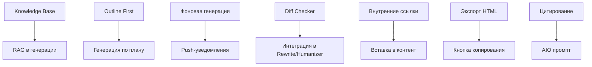

# План разработки новых функций SEO Generator

## Обзор документа

Этот документ описывает план разработки новых функций для SEO Generator - Telegram WebApp для генерации SEO-оптимизированного контента.

**Дата создания:** 26 декабря 2025  
**Текущая версия:** v1.0  
**Статус проекта:** Production-ready с базовым функционалом

---

## 1. Улучшение AI-ядра (Контекст и Качество)

### 1.1 Knowledge Base / RAG (Retrieval-Augmented Generation)

#### Проблема
Даже если загрузить пример стиля, модель может забыть бренд-голос или факты о компании, что приводит к неточностям в генерируемом контенте.

#### Решение
Добавить возможность загрузить "Базу знаний" (PDF, DOCX с описанием компании, услуг, Tone of Voice). При генерации AI будет обращаться к этому файлу, чтобы не выдумывать факты.

#### Техническая реализация

##### База данных (Prisma Schema)
```prisma
model KnowledgeBase {
  id          String   @id @default(uuid())
  userId      String
  user        User     @relation(fields: [userId], references: [id], onDelete: Cascade)
  
  fileName    String
  fileType    String   // "pdf" | "docx" | "txt"
  fileSize    Int      // в байтах
  
  content     String   @db.Text   // извлечённый текст
  embeddings  Json?    // векторные представления (если используется векторная БД)
  
  createdAt   DateTime @default(now())
  updatedAt   DateTime @updatedAt
  
  @@index([userId])
  @@index([userId, createdAt(sort: Desc)])
}
```

##### Обновление User модели
```prisma
model User {
  // ... существующие поля ...
  
  // Новые поля
  knowledgeBaseFiles KnowledgeBase[]
  internalLinks      InternalLinks[]
  backgroundTasks   BackgroundTask[]
  
  // Настройки уведомлений
  notificationsEnabled Boolean @default(true)
}
```

##### API Endpoints

**POST /api/knowledge-base/upload**
- Загрузка PDF/DOCX/TXT файлов
- Извлечение текста из файла
- Опциональная векторизация для RAG
- Сохранение в базу данных

**GET /api/knowledge-base**
- Получение списка файлов Knowledge Base пользователя

**DELETE /api/knowledge-base/:id**
- Удаление файла из Knowledge Base

**POST /api/knowledge-base/search**
- Поиск релевантных фрагментов по запросу (RAG)

##### Зависимости
```json
{
  "pdf-parse": "^1.1.1",
  "mammoth": "^1.8.0", // уже есть
  "@pinecone-database/pinecone": "^2.0.0" // опционально для векторной БД
}
```

##### Сервисы

**apps/backend/services/knowledgeBaseService.js**
```javascript
import { prisma } from '../lib/prisma.js';
import pdf from 'pdf-parse';
import mammoth from 'mammoth';

export class KnowledgeBaseService {
  // Загрузка и парсинг файла
  async uploadFile(userId, file) {
    let content;
    
    if (file.type === 'application/pdf') {
      content = await this.parsePDF(file.buffer);
    } else if (file.type === 'application/vnd.openxmlformats-officedocument.wordprocessingml.document') {
      content = await this.parseDOCX(file.buffer);
    } else if (file.type === 'text/plain') {
      content = file.buffer.toString('utf-8');
    }
    
    // Опциональная векторизация
    const embeddings = await this.generateEmbeddings(content);
    
    return await prisma.knowledgeBase.create({
      data: {
        userId,
        fileName: file.originalname,
        fileType: file.type,
        fileSize: file.size,
        content,
        embeddings
      }
    });
  }
  
  // Поиск релевантных фрагментов (RAG)
  async search(userId, query, topK = 3) {
    const files = await prisma.knowledgeBase.findMany({
      where: { userId },
      orderBy: { createdAt: 'desc' }
    });
    
    // Простая реализация через косинусное сходство
    const queryEmbedding = await this.generateEmbeddings(query);
    
    const results = [];
    for (const file of files) {
      if (!file.embeddings) continue;
      
      const similarity = this.cosineSimilarity(queryEmbedding, file.embeddings);
      results.push({
        file,
        similarity,
        snippet: this.extractRelevantSnippet(file.content, query)
      });
    }
    
    return results
      .sort((a, b) => b.similarity - a.similarity)
      .slice(0, topK);
  }
  
  // Вспомогательные методы
  async parsePDF(buffer) {
    const data = await pdf(buffer);
    return data.text;
  }
  
  async parseDOCX(buffer) {
    const result = await mammoth.extractRawText({ buffer });
    return result.value;
  }
  
  async generateEmbeddings(text) {
    // Использовать OpenAI embeddings или альтернативу
    // Например: text-embedding-3-small
    const response = await fetch('https://api.openai.com/v1/embeddings', {
      method: 'POST',
      headers: {
        'Authorization': `Bearer ${process.env.OPENAI_API_KEY}`,
        'Content-Type': 'application/json'
      },
      body: JSON.stringify({
        model: 'text-embedding-3-small',
        input: text.substring(0, 8191) // лимит токенов
      })
    });
    
    const data = await response.json();
    return data.data[0].embedding;
  }
  
  cosineSimilarity(vecA, vecB) {
    const dotProduct = vecA.reduce((sum, a, i) => sum + a * vecB[i], 0);
    const magnitudeA = Math.sqrt(vecA.reduce((sum, a) => sum + a * a, 0));
    const magnitudeB = Math.sqrt(vecB.reduce((sum, b) => sum + b * b, 0));
    return dotProduct / (magnitudeA * magnitudeB);
  }
  
  extractRelevantSnippet(content, query, maxLength = 200) {
    const queryLower = query.toLowerCase();
    const contentLower = content.toLowerCase();
    const index = contentLower.indexOf(queryLower);
    
    if (index === -1) {
      return content.substring(0, maxLength) + '...';
    }
    
    const start = Math.max(0, index - 50);
    const end = Math.min(content.length, index + query.length + 150);
    
    return '...' + content.substring(start, end) + '...';
  }
}
```

##### Интеграция в генерацию

Модификация промпта в [`apps/backend/routes/generate.js`](apps/backend/routes/generate.js:43):

```javascript
// Перед генерацией контента
const kbService = new KnowledgeBaseService();
const kbContext = await kbService.search(userId, topic, topK = 3);

if (kbContext.length > 0) {
  const contextString = kbContext
    .map((item, i) => `
### КОНТЕКСТ ИЗ БАЗЫ ЗНАНИЙ [Источник ${i + 1}]
Файл: ${item.file.fileName}
${item.snippet}
`)
    .join('\n');
  
  prompt = `
${contextString}

---
${prompt}
`;
}
```

##### Frontend компоненты

**components/KnowledgeBaseUploader.tsx**
```typescript
import React, { useState } from 'react';
import { FileUpload } from './FileUpload';

interface KnowledgeBaseFile {
  id: string;
  fileName: string;
  fileType: string;
  fileSize: number;
  createdAt: string;
}

export function KnowledgeBaseUploader() {
  const [files, setFiles] = useState<KnowledgeBaseFile[]>([]);
  const [uploading, setUploading] = useState(false);
  
  const handleUpload = async (file: File) => {
    setUploading(true);
    try {
      const formData = new FormData();
      formData.append('file', file);
      
      const response = await fetch('/api/knowledge-base/upload', {
        method: 'POST',
        body: formData
      });
      
      if (response.ok) {
        const result = await response.json();
        setFiles([...files, result]);
      }
    } catch (error) {
      console.error('Upload failed:', error);
    } finally {
      setUploading(false);
    }
  };
  
  const handleDelete = async (id: string) => {
    await fetch(`/api/knowledge-base/${id}`, { method: 'DELETE' });
    setFiles(files.filter(f => f.id !== id));
  };
  
  return (
    <div className="kb-uploader">
      <h3>База знаний</h3>
      <p>Загрузите PDF, DOCX или TXT файлы с информацией о компании, услугах и Tone of Voice</p>
      
      <FileUpload
        onUpload={handleUpload}
        accept=".pdf,.docx,.txt"
        maxSize={10485760} // 10MB
      />
      
      <div className="kb-files">
        {files.map(file => (
          <div key={file.id} className="kb-file">
            <span>{file.fileName}</span>
            <button onClick={() => handleDelete(file.id)}>Удалить</button>
          </div>
        ))}
      </div>
    </div>
  );
}
```

---

### 1.2 Режим "Outline First" (Сначала структура)

#### Проблема
Для длинных текстов (лонгридов) критически важно утвердить план (H1, H2, H3) перед написанием полного текста. Пользователь должен иметь возможность вручную поправить план.

#### Решение
Прежде чем писать полный текст, дать пользователю утвердить план. Пользователь может руками поправить план (переместить блоки, удалить лишнее) и только потом заполнить его текстом.

#### Техническая реализация

##### API Endpoints

**POST /api/generate/outline**
```javascript
router.post('/outline', validate(generateSchema), async (req, res) => {
  const { config, keywords } = req.body;
  const apiKey = await getApiKey();
  
  const outlinePrompt = `Создай детальный план статьи по теме: "${config.topic}"

Требования:
- Язык: ${config.language}
- Количество секций: 5-8 H2 заголовков
- Для каждого H2 добавь 2-4 H3 подзаголовка
- Учитывай ключевые слова: ${keywords.slice(0, 10).map(k => k.keyword).join(', ')}

Верни ТОЛЬКО JSON:
{
  "h1": "Заголовок статьи",
  "sections": [
    {
      "h2": "Заголовок секции",
      "h3s": ["Подзаголовок 1", "Подзаголовок 2"]
    }
  ]
}`;
  
  const response = await fetch("https://openrouter.ai/api/v1/chat/completions", {
    method: "POST",
    headers: getHeaders(apiKey, config.websiteName),
    body: JSON.stringify({
      model: config.model,
      messages: [
        { role: "system", content: "Ты эксперт по структуре контента. Создавай логичные, SEO-оптимизированные планы статей." },
        { role: "user", content: outlinePrompt }
      ],
      temperature: 0.3,
      response_format: { type: "json_object" }
    })
  });
  
  const data = await response.json();
  const outline = JSON.parse(data.choices[0].message.content);
  
  res.json({ outline });
});
```

**POST /api/generate/from-outline**
```javascript
router.post('/from-outline', async (req, res) => {
  const { outline, config, keywords } = req.body;
  const apiKey = await getApiKey();
  
  // Формируем секции для генерации
  const sectionsPrompt = outline.sections.map(section => `
## ${section.h2}
${section.h3s.map(h3 => `### ${h3}`).join('\n')}
`).join('\n');
  
  const contentPrompt = `Напиши полную статью по следующему плану:

# ${outline.h1}

${sectionsPrompt}

Требования:
- Язык: ${config.language}
- Тон: ${config.tone}
- Стиль: ${config.style}
- Ключевые слова: ${keywords.slice(0, 15).map(k => k.keyword).join(', ')}
- Минимум символов: ${config.minChars}
- Максимум символов: ${config.maxChars}

Напиши статью в формате Markdown.`;
  
  const response = await fetch("https://openrouter.ai/api/v1/chat/completions", {
    method: "POST",
    headers: getHeaders(apiKey, config.websiteName),
    body: JSON.stringify({
      model: config.model,
      messages: [
        { role: "system", content: "Ты профессиональный копирайтер. Пиши качественный, уникальный контент." },
        { role: "user", content: contentPrompt }
      ],
      temperature: 0.7,
      max_tokens: 8000
    })
  });
  
  const data = await response.json();
  const content = data.choices[0].message.content;
  
  res.json({ content });
});
```

##### Frontend компоненты

**components/OutlineEditor.tsx**
```typescript
import React, { useState } from 'react';
import { DragDropContext, Droppable, Draggable } from 'react-beautiful-dnd';

interface OutlineSection {
  h2: string;
  h3s: string[];
}

interface Outline {
  h1: string;
  sections: OutlineSection[];
}

export function OutlineEditor() {
  const [outline, setOutline] = useState<Outline | null>(null);
  const [editing, setEditing] = useState(false);
  
  const handleGenerateOutline = async () => {
    const response = await fetch('/api/generate/outline', {
      method: 'POST',
      body: JSON.stringify({ config, keywords })
    });
    const data = await response.json();
    setOutline(data.outline);
  };
  
  const handleDragEnd = (result: any) => {
    if (!result.destination) return;
    
    const newSections = Array.from(outline.sections);
    const [reorderedItem] = newSections.splice(result.source.index, 1);
    newSections.splice(result.destination.index, 0, reorderedItem);
    
    setOutline({ ...outline, sections: newSections });
  };
  
  const handleGenerateContent = async () => {
    const response = await fetch('/api/generate/from-outline', {
      method: 'POST',
      body: JSON.stringify({ outline, config, keywords })
    });
    const data = await response.json();
    // Обработка результата
  };
  
  return (
    <div className="outline-editor">
      {!outline ? (
        <button onClick={handleGenerateOutline}>
          Сгенерировать план
        </button>
      ) : (
        <>
          <input
            value={outline.h1}
            onChange={(e) => setOutline({ ...outline, h1: e.target.value })}
            placeholder="Заголовок H1"
          />
          
          <DragDropContext onDragEnd={handleDragEnd}>
            <Droppable droppableId="sections">
              {(provided) => (
                <div {...provided.droppableProps} ref={provided.innerRef}>
                  {outline.sections.map((section, index) => (
                    <Draggable key={index} draggableId={String(index)} index={index}>
                      {(provided) => (
                        <div
                          ref={provided.innerRef}
                          {...provided.draggableProps}
                          {...provided.dragHandleProps}
                          className="outline-section"
                        >
                          <input
                            value={section.h2}
                            onChange={(e) => {
                              const newSections = [...outline.sections];
                              newSections[index].h2 = e.target.value;
                              setOutline({ ...outline, sections: newSections });
                            }}
                            placeholder="Заголовок H2"
                          />
                          
                          {section.h3s.map((h3, h3Index) => (
                            <input
                              key={h3Index}
                              value={h3}
                              onChange={(e) => {
                                const newSections = [...outline.sections];
                                newSections[index].h3s[h3Index] = e.target.value;
                                setOutline({ ...outline, sections: newSections });
                              }}
                              placeholder="Заголовок H3"
                              className="h3-input"
                            />
                          ))}
                          
                          <button onClick={() => {
                            const newSections = [...outline.sections];
                            newSections[index].h3s.push('');
                            setOutline({ ...outline, sections: newSections });
                          }}>
                            + Добавить H3
                          </button>
                          
                          <button onClick={() => {
                            const newSections = outline.sections.filter((_, i) => i !== index);
                            setOutline({ ...outline, sections: newSections });
                          }}>
                            Удалить секцию
                          </button>
                        </div>
                      )}
                    </Draggable>
                  ))}
                  {provided.placeholder}
                </div>
              )}
            </Droppable>
          </DragDropContext>
          
          <button onClick={() => setOutline({ ...outline, sections: [...outline.sections, { h2: '', h3s: [''] }] })}>
            + Добавить секцию
          </button>
          
          <button onClick={handleGenerateContent}>
            Сгенерировать контент по плану
          </button>
        </>
      )}
    </div>
  );
}
```

---

## 2. Редактор и UX в Telegram Web App

### 2.1 Markdown-редактор с подсветкой ключевых слов

#### Проблема
Пользователю сложно оценить плотность ключевых слов без открытия метрик.

#### Решение
В окне редактора подсвечивать использованные LSI-ключи (зеленым), а пропущенные — красным.

#### Техническая реализация

##### Frontend компонент

**components/MarkdownEditor.tsx**
```typescript
import React, { useState, useEffect } from 'react';
import ReactMarkdown from 'react-markdown';
import remarkGfm from 'remark-gfm';

interface MarkdownEditorProps {
  content: string;
  keywords: string[];
  onChange: (content: string) => void;
}

export function MarkdownEditor({ content, keywords, onChange }: MarkdownEditorProps) {
  const [highlightedContent, setHighlightedContent] = useState('');
  
  useEffect(() => {
    // Анализируем использованные ключевые слова
    const contentLower = content.toLowerCase();
    const usedKeywords = keywords.filter(kw => 
      contentLower.includes(kw.toLowerCase())
    );
    const missingKeywords = keywords.filter(kw => 
      !contentLower.includes(kw.toLowerCase())
    );
    
    // Подсвечиваем ключевые слова в контенте
    let highlighted = content;
    usedKeywords.forEach(kw => {
      const regex = new RegExp(`(${kw})`, 'gi');
      highlighted = highlighted.replace(regex, '<mark class="keyword-used">$1</mark>');
    });
    
    setHighlightedContent(highlighted);
  }, [content, keywords]);
  
  return (
    <div className="markdown-editor">
      <div className="editor-toolbar">
        <div className="keyword-stats">
          <span className="used">
            Использовано: {keywords.filter(kw => content.toLowerCase().includes(kw.toLowerCase())).length}
          </span>
          <span className="missing">
            Пропущено: {keywords.filter(kw => !content.toLowerCase().includes(kw.toLowerCase())).length}
          </span>
        </div>
      </div>
      
      <textarea
        value={content}
        onChange={(e) => onChange(e.target.value)}
        className="editor-textarea"
        placeholder="Введите или вставьте ваш контент..."
      />
      
      <div className="editor-preview">
        <ReactMarkdown remarkPlugins={[remarkGfm]}>
          {highlightedContent}
        </ReactMarkdown>
      </div>
      
      <style jsx>{`
        .keyword-used {
          background-color: #d4edda;
          padding: 2px 4px;
          border-radius: 3px;
        }
        .keyword-missing {
          background-color: #f8d7da;
          padding: 2px 4px;
          border-radius: 3px;
        }
      `}</style>
    </div>
  );
}
```

---

### 2.2 Diff Checker (Сравнение версий)

#### Проблема
Для функции "Рерайт" и "Humanizer" пользователь видит только новый блок текста, а не то, что именно изменилось.

#### Решение
Сделать визуальное сравнение "Было / Стало" (как в Google Docs или Word).

#### Техническая реализация

##### Зависимости
```json
{
  "diff": "^5.1.0"
}
```

##### Frontend компонент

**components/DiffViewer.tsx**
```typescript
import React from 'react';
import { diffWords, diffWordsWithSpace } from 'diff';

interface DiffViewerProps {
  original: string;
  modified: string;
}

export function DiffViewer({ original, modified }: DiffViewerProps) {
  const diff = diffWords(original, modified);
  
  return (
    <div className="diff-viewer">
      <div className="diff-header">
        <h3>Сравнение версий</h3>
        <div className="diff-stats">
          <span className="additions">
            +{diff.filter(d => d.added).length} изменений
          </span>
          <span className="deletions">
            -{diff.filter(d => d.removed).length} удалений
          </span>
        </div>
      </div>
      
      <div className="diff-content">
        {diff.map((part, index) => {
          if (part.added) {
            return (
              <span key={index} className="diff-added">
                {part.value}
              </span>
            );
          }
          if (part.removed) {
            return (
              <span key={index} className="diff-removed">
                {part.value}
              </span>
            );
          }
          return (
            <span key={index} className="diff-unchanged">
              {part.value}
            </span>
          );
        })}
      </div>
      
      <style jsx>{`
        .diff-added {
          background-color: #d4edda;
          text-decoration: none;
        }
        .diff-removed {
          background-color: #f8d7da;
          text-decoration: line-through;
        }
        .diff-unchanged {
          color: #333;
        }
      `}</style>
    </div>
  );
}
```

---

## 3. Продвинутый SEO функционал

### 3.1 Внутренняя перелинковка (Internal Linking)

#### Проблема
Внутренняя перелинковка — "святой грааль" SEO, но её сложно внедрять вручную.

#### Решение
Добавить поле, куда юзер загружает список своих внутренних URL. AI должен сам вставлять ссылки на эти страницы в контекст с нужными анкорами.

#### Техническая реализация

##### База данных (Prisma Schema)
```prisma
model InternalLinks {
  id          String   @id @default(uuid())
  userId      String
  user        User     @relation(fields: [userId], references: [id], onDelete: Cascade)
  
  url         String
  anchorText  String?
  keywords    String[] // ключевые слова для контекстной вставки
  priority    Int      @default(0) // приоритет ссылки
  
  createdAt   DateTime @default(now())
  updatedAt   DateTime @updatedAt
  
  @@index([userId])
  @@index([userId, priority(sort: Desc)])
}
```

##### API Endpoints

**POST /api/internal-links/upload**
```javascript
router.post('/upload', async (req, res) => {
  const { userId } = req.telegramUser;
  const { links } = req.body; // [{ url, anchorText, keywords: [] }]
  
  const createdLinks = await Promise.all(
    links.map(link => 
      prisma.internalLinks.create({
        data: {
          userId,
          url: link.url,
          anchorText: link.anchorText,
          keywords: link.keywords || [],
          priority: link.priority || 0
        }
      })
    )
  );
  
  res.json({ links: createdLinks });
});
```

**GET /api/internal-links**
```javascript
router.get('/', async (req, res) => {
  const { userId } = req.telegramUser;
  
  const links = await prisma.internalLinks.findMany({
    where: { userId },
    orderBy: { priority: 'desc' }
  });
  
  res.json({ links });
});
```

**DELETE /api/internal-links/:id**
```javascript
router.delete('/:id', async (req, res) => {
  const { userId } = req.telegramUser;
  
  await prisma.internalLinks.deleteMany({
    where: { id: req.params.id, userId }
  });
  
  res.json({ success: true });
});
```

##### Сервис для вставки ссылок

**apps/backend/services/internalLinkingService.js**
```javascript
export class InternalLinkingService {
  constructor(userId) {
    this.userId = userId;
  }
  
  async insertLinks(content, maxLinks = 5) {
    const links = await prisma.internalLinks.findMany({
      where: { userId: this.userId },
      orderBy: { priority: 'desc' }
    });
    
    let modifiedContent = content;
    let insertedCount = 0;
    
    for (const link of links) {
      if (insertedCount >= maxLinks) break;
      
      // Ищем контекст для вставки ссылки
      const keywords = link.keywords || this.extractKeywords(link.anchorText);
      
      for (const keyword of keywords) {
        if (insertedCount >= maxLinks) break;
        
        const regex = new RegExp(`(${keyword})`, 'gi');
        const match = modifiedContent.match(regex);
        
        if (match && !modifiedContent.includes(link.url)) {
          const anchor = link.anchorText || keyword;
          const linkHtml = `[${anchor}](${link.url})`;
          
          modifiedContent = modifiedContent.replace(regex, linkHtml);
          insertedCount++;
          break;
        }
      }
    }
    
    return modifiedContent;
  }
  
  extractKeywords(text) {
    // Простая экстракция ключевых слов из анкора
    return text
      .toLowerCase()
      .split(/\s+/)
      .filter(word => word.length > 3);
  }
}
```

##### Интеграция в генерацию

Модификация промпта:

```javascript
const internalLinksService = new InternalLinkingService(userId);
const internalLinks = await prisma.internalLinks.findMany({
  where: { userId },
  orderBy: { priority: 'desc' }
});

if (internalLinks.length > 0) {
  const linksContext = internalLinks
    .map(link => `- ${link.url} (анкор: "${link.anchorText}", ключи: ${link.keywords.join(', ')})`)
    .join('\n');
  
  prompt = `
### ВНУТРЕННИЕ ССЫЛКИ
Вставь следующие внутренние ссылки в контекстуально подходящие места статьи:

${linksContext}

Правила:
1. Вставляй ссылки только там, где они органично вписываются в контекст
2. Используй указанные анкоры или контекстуально подходящие фразы
3. Не вставляй более ${internalLinks.length} ссылок
4. Формат: [анкор текст](URL)

---
${prompt}
`;
}
```

##### Frontend компонент

**components/InternalLinksManager.tsx**
```typescript
import React, { useState } from 'react';

interface InternalLink {
  id: string;
  url: string;
  anchorText?: string;
  keywords: string[];
  priority: number;
}

export function InternalLinksManager() {
  const [links, setLinks] = useState<InternalLink[]>([]);
  const [newLink, setNewLink] = useState({
    url: '',
    anchorText: '',
    keywords: '',
    priority: 0
  });
  
  const handleAddLink = async () => {
    const response = await fetch('/api/internal-links/upload', {
      method: 'POST',
      headers: { 'Content-Type': 'application/json' },
      body: JSON.stringify({
        links: [{
          ...newLink,
          keywords: newLink.keywords.split(',').map(k => k.trim())
        }]
      })
    });
    
    if (response.ok) {
      const data = await response.json();
      setLinks([...links, ...data.links]);
      setNewLink({ url: '', anchorText: '', keywords: '', priority: 0 });
    }
  };
  
  return (
    <div className="internal-links-manager">
      <h3>Внутренние ссылки</h3>
      
      <div className="add-link-form">
        <input
          type="url"
          placeholder="URL страницы"
          value={newLink.url}
          onChange={(e) => setNewLink({ ...newLink, url: e.target.value })}
        />
        <input
          placeholder="Анкор текст (опционально)"
          value={newLink.anchorText}
          onChange={(e) => setNewLink({ ...newLink, anchorText: e.target.value })}
        />
        <input
          placeholder="Ключевые слова (через запятую)"
          value={newLink.keywords}
          onChange={(e) => setNewLink({ ...newLink, keywords: e.target.value })}
        />
        <input
          type="number"
          placeholder="Приоритет"
          value={newLink.priority}
          onChange={(e) => setNewLink({ ...newLink, priority: parseInt(e.target.value) })}
        />
        <button onClick={handleAddLink}>Добавить</button>
      </div>
      
      <div className="links-list">
        {links.map(link => (
          <div key={link.id} className="link-item">
            <a href={link.url} target="_blank" rel="noopener noreferrer">
              {link.url}
            </a>
            <span>{link.anchorText || 'Авто-анкор'}</span>
            <span>Приоритет: {link.priority}</span>
            <button onClick={() => handleDelete(link.id)}>Удалить</button>
          </div>
        ))}
      </div>
    </div>
  );
}
```

---

### 3.2 Экспорт в HTML с разметкой

#### Проблема
Копирайтеры часто работают в WordPress/Bitrix и нуждаются в готовом HTML с правильной разметкой.

#### Решение
Сделать кнопку "Копировать HTML", где H1-H6 будут тегами, списки — `<ul>`, жирный — `<strong>`, а ключевые слова обёрнуты в желаемые теги.

#### Техническая реализация

##### Сервис экспорта

**services/htmlExportService.ts**
```typescript
export class HtmlExportService {
  /**
   * Конвертирует Markdown в HTML с SEO-разметкой
   */
  static markdownToHtml(
    markdown: string,
    options: {
      wrapKeywords?: boolean;
      keywordTag?: string;
      keywords?: string[];
    } = {}
  ): string {
    const { wrapKeywords = false, keywordTag = 'strong', keywords = [] } = options;
    
    let html = markdown;
    
    // Конвертация заголовков
    html = html.replace(/^# (.+)$/gm, '<h1>$1</h1>');
    html = html.replace(/^## (.+)$/gm, '<h2>$1</h2>');
    html = html.replace(/^### (.+)$/gm, '<h3>$1</h3>');
    html = html.replace(/^#### (.+)$/gm, '<h4>$1</h4>');
    html = html.replace(/^##### (.+)$/gm, '<h5>$1</h5>');
    html = html.replace(/^###### (.+)$/gm, '<h6>$1</h6>');
    
    // Конвертация списков
    html = this.convertLists(html);
    
    // Конвертация жирного текста
    html = html.replace(/\*\*(.+?)\*\*/g, '<strong>$1</strong>');
    html = html.replace(/__(.+?)__/g, '<strong>$1</strong>');
    
    // Конвертация курсива
    html = html.replace(/\*(.+?)\*/g, '<em>$1</em>');
    html = html.replace(/_(.+?)_/g, '<em>$1</em>');
    
    // Конвертация ссылок
    html = html.replace(/\[([^\]]+)\]\(([^)]+)\)/g, '<a href="$2">$1</a>');
    
    // Обёртывание ключевых слов
    if (wrapKeywords && keywords.length > 0) {
      html = this.wrapKeywords(html, keywords, keywordTag);
    }
    
    // Конвертация параграфов
    html = html.split('\n\n').map(para => {
      if (!para.trim()) return '';
      if (para.startsWith('<')) return para; // Уже HTML-тег
      return `<p>${para.trim()}</p>`;
    }).join('\n');
    
    return html;
  }
  
  /**
   * Конвертирует Markdown списки в HTML
   */
  private static convertLists(html: string): string {
    const lines = html.split('\n');
    let result = [];
    let inUl = false;
    let inOl = false;
    
    for (const line of lines) {
      const ulMatch = line.match(/^[\*\-] (.+)$/);
      const olMatch = line.match(/^\d+\. (.+)$/);
      
      if (ulMatch) {
        if (!inUl) {
          result.push('<ul>');
          inUl = true;
        }
        if (inOl) {
          result.push('</ol>');
          inOl = false;
        }
        result.push(`<li>${ulMatch[1]}</li>`);
      } else if (olMatch) {
        if (!inOl) {
          result.push('<ol>');
          inOl = true;
        }
        if (inUl) {
          result.push('</ul>');
          inUl = false;
        }
        result.push(`<li>${olMatch[1]}</li>`);
      } else {
        if (inUl) {
          result.push('</ul>');
          inUl = false;
        }
        if (inOl) {
          result.push('</ol>');
          inOl = false;
        }
        result.push(line);
      }
    }
    
    if (inUl) result.push('</ul>');
    if (inOl) result.push('</ol>');
    
    return result.join('\n');
  }
  
  /**
   * Обёртывает ключевые слова в указанный тег
   */
  private static wrapKeywords(html: string, keywords: string[], tag: string): string {
    let result = html;
    
    for (const keyword of keywords) {
      const regex = new RegExp(`(${keyword})`, 'gi');
      result = result.replace(regex, `<${tag}>$1</${tag}>`);
    }
    
    return result;
  }
  
  /**
   * Генерирует полный HTML документ
   */
  static generateFullHtml(
    content: string,
    meta: {
      title?: string;
      description?: string;
      keywords?: string;
    }
  ): string {
    return `<!DOCTYPE html>
<html lang="ru">
<head>
  <meta charset="UTF-8">
  <meta name="viewport" content="width=device-width, initial-scale=1.0">
  ${meta.title ? `<title>${meta.title}</title>` : ''}
  ${meta.description ? `<meta name="description" content="${meta.description}">` : ''}
  ${meta.keywords ? `<meta name="keywords" content="${meta.keywords}">` : ''}
</head>
<body>
${content}
</body>
</html>`;
  }
}
```

##### API Endpoint

**POST /api/export/html**
```javascript
router.post('/html', async (req, res) => {
  const { markdown, options } = req.body;
  
  const html = HtmlExportService.markdownToHtml(markdown, options);
  
  res.json({ html });
});
```

##### Frontend компонент

**components/HtmlExportButton.tsx**
```typescript
import React from 'react';
import { HtmlExportService } from '../services/htmlExportService';

interface HtmlExportButtonProps {
  content: string;
  keywords: string[];
  meta?: {
    title?: string;
    description?: string;
  };
}

export function HtmlExportButton({ content, keywords, meta }: HtmlExportButtonProps) {
  const handleExport = () => {
    const html = HtmlExportService.markdownToHtml(content, {
      wrapKeywords: true,
      keywordTag: 'strong',
      keywords
    });
    
    navigator.clipboard.writeText(html).then(() => {
      alert('HTML скопирован в буфер обмена!');
    });
  };
  
  return (
    <button onClick={handleExport} className="html-export-btn">
      📋 Копировать HTML
    </button>
  );
}
```

---

## 4. Асинхронность и Уведомления

### 4.1 Фоновая генерация

#### Проблема
Генерация больших текстов может длиться 1-2 минуты. В Telegram WebApp нельзя свернуть приложение и ждать.

#### Решение
Запустить генерацию в фоне, закрыть приложение. Когда всё готово, бот пришлёт уведомление: "Твой текст готов, нажми, чтобы открыть".

#### Техническая реализация

##### База данных (Prisma Schema)
```prisma
model BackgroundTask {
  id          String   @id @default(uuid())
  userId      String
  user        User     @relation(fields: [userId], references: [id], onDelete: Cascade)
  
  type        String   // "generate" | "rewrite" | "humanize"
  status      String   @default("pending") // "pending" | "processing" | "completed" | "failed"
  config      Json     // конфигурация задачи
  result      Json?    // результат выполнения
  error       String?  // текст ошибки
  
  createdAt   DateTime @default(now())
  startedAt   DateTime?
  completedAt DateTime?
  
  @@index([userId])
  @@index([status])
  @@index([userId, createdAt(sort: Desc)])
}
```

##### Сервис очереди задач

**apps/backend/services/taskQueueService.js**
```javascript
import { prisma } from '../lib/prisma.js';
import { sendTelegramNotification } from './subscriptionManager.js';

export class TaskQueueService {
  constructor() {
    this.processing = false;
    this.queue = [];
    this.startProcessing();
  }
  
  /**
   * Создаёт фоновую задачу
   */
  async createTask(userId, type, config) {
    const task = await prisma.backgroundTask.create({
      data: {
        userId,
        type,
        status: 'pending',
        config
      }
    });
    
    this.queue.push(task.id);
    return task;
  }
  
  /**
   * Запускает обработчик очереди
   */
  startProcessing() {
    setInterval(async () => {
      if (this.processing || this.queue.length === 0) return;
      
      this.processing = true;
      
      while (this.queue.length > 0) {
        const taskId = this.queue.shift();
        await this.processTask(taskId);
      }
      
      this.processing = false;
    }, 5000); // Проверка каждые 5 секунд
  }
  
  /**
   * Обрабатывает задачу
   */
  async processTask(taskId) {
    const task = await prisma.backgroundTask.findUnique({
      where: { id: taskId }
    });
    
    if (!task || task.status !== 'pending') return;
    
    // Обновляем статус
    await prisma.backgroundTask.update({
      where: { id: taskId },
      data: { status: 'processing', startedAt: new Date() }
    });
    
    try {
      let result;
      
      switch (task.type) {
        case 'generate':
          result = await this.processGenerateTask(task.config);
          break;
        case 'rewrite':
          result = await this.processRewriteTask(task.config);
          break;
        case 'humanize':
          result = await this.processHumanizeTask(task.config);
          break;
        default:
          throw new Error(`Unknown task type: ${task.type}`);
      }
      
      // Сохраняем результат
      await prisma.backgroundTask.update({
        where: { id: taskId },
        data: {
          status: 'completed',
          result,
          completedAt: new Date()
        }
      });
      
      // Отправляем уведомление
      await this.sendCompletionNotification(task.userId, taskId, task.type);
      
    } catch (error) {
      await prisma.backgroundTask.update({
        where: { id: taskId },
        data: {
          status: 'failed',
          error: error.message,
          completedAt: new Date()
        }
      });
      
      // Отправляем уведомление об ошибке
      await this.sendErrorNotification(task.userId, taskId, error.message);
    }
  }
  
  /**
   * Обрабатывает задачу генерации
   */
  async processGenerateTask(config) {
    // Вызываем существующую логику генерации
    // ... код из generate.js ...
    return result;
  }
  
  /**
   * Отправляет уведомление о завершении
   */
  async sendCompletionNotification(userId, taskId, type) {
    const user = await prisma.user.findUnique({
      where: { id: userId }
    });
    
    if (!user.notificationsEnabled) return;
    
    const message = `✅ Ваш ${type === 'generate' ? 'текст' : type === 'rewrite' ? 'рерайт' : 'хьюманизированный текст'} готов!`;
    
    await sendTelegramNotification(user.telegramId, message, {
      inline_keyboard: [[{
        text: '📄 Открыть результат',
        callback_data: `open_task_${taskId}`
      }]]
    });
  }
  
  /**
   * Отправляет уведомление об ошибке
   */
  async sendErrorNotification(userId, taskId, error) {
    const user = await prisma.user.findUnique({
      where: { id: userId }
    });
    
    if (!user.notificationsEnabled) return;
    
    const message = `❌ Произошла ошибка при генерации: ${error}`;
    
    await sendTelegramNotification(user.telegramId, message);
  }
}

// Глобальный экземпляр
export const taskQueue = new TaskQueueService();
```

##### API Endpoints

**POST /api/generate (с поддержкой async)**
```javascript
router.post('/', validate(generateSchema), async (req, res) => {
  const { config, keywords, async: isAsync = false } = req.body;
  const telegramId = req.telegramUser.id;
  
  if (isAsync) {
    // Создаём фоновую задачу
    const user = await prisma.user.findUnique({
      where: { telegramId: BigInt(telegramId) }
    });
    
    const task = await taskQueue.createTask(user.id, 'generate', {
      config,
      keywords
    });
    
    res.json({ 
      taskId: task.id, 
      status: 'pending',
      message: 'Генерация запущена в фоновом режиме. Вы получите уведомление когда текст будет готов.'
    });
  } else {
    // Синхронная генерация (существующий код)
    // ...
  }
});
```

**GET /api/tasks/:id**
```javascript
router.get('/:id', async (req, res) => {
  const { userId } = req.telegramUser;
  
  const task = await prisma.backgroundTask.findFirst({
    where: {
      id: req.params.id,
      userId
    }
  });
  
  if (!task) {
    return res.status(404).json({ error: 'Task not found' });
  }
  
  res.json({ task });
});
```

**GET /api/tasks**
```javascript
router.get('/', async (req, res) => {
  const { userId } = req.telegramUser;
  
  const tasks = await prisma.backgroundTask.findMany({
    where: { userId },
    orderBy: { createdAt: 'desc' },
    take: 20
  });
  
  res.json({ tasks });
});
```

---

### 4.2 Push-уведомления через Telegram

#### Техническая реализация

##### Обновление subscriptionManager.js

```javascript
import TelegramBot from 'node-telegram-bot-api';

export async function sendTelegramNotification(telegramId, message, options = {}) {
  const bot = new TelegramBot(process.env.BOT_TOKEN);
  
  try {
    await bot.sendMessage(telegramId, message, options);
  } catch (error) {
    console.error('Failed to send notification:', error);
  }
}

export async function sendInlineNotification(telegramId, message, buttons) {
  return sendTelegramNotification(telegramId, message, {
    parse_mode: 'HTML',
    reply_markup: {
      inline_keyboard: buttons
    }
  });
}
```

##### Обработка callback от inline-кнопки

В [`apps/backend/routes/webhook.js`](apps/backend/routes/webhook.js):

```javascript
// Обработка callback от inline-кнопок
bot.on('callback_query', async (query) => {
  const callbackData = query.data;
  
  if (callbackData.startsWith('open_task_')) {
    const taskId = callbackData.replace('open_task_', '');
    
    // Получаем задачу
    const task = await prisma.backgroundTask.findUnique({
      where: { id: taskId }
    });
    
    if (task && task.status === 'completed') {
      // Формируем URL для открытия WebApp с результатом
      const webAppUrl = `${process.env.FRONTEND_URL}?task=${taskId}`;
      
      await bot.answerCallbackQuery(query.id);
      await bot.sendMessage(
        query.message.chat.id,
        '📄 Откройте результат:',
        {
          reply_markup: {
            inline_keyboard: [[{
              text: '🚀 Открыть',
              web_app: { url: webAppUrl }
            }]]
          }
        }
      );
    } else {
      await bot.answerCallbackQuery(query.id, {
        text: 'Задача ещё не завершена или не найдена',
        show_alert: true
      });
    }
  }
});
```

##### Настройки уведомлений в пользовательском профиле

**components/NotificationSettings.tsx**
```typescript
import React, { useState, useEffect } from 'react';

export function NotificationSettings() {
  const [enabled, setEnabled] = useState(true);
  
  useEffect(() => {
    // Загрузка настроек
    fetch('/api/settings/notifications')
      .then(res => res.json())
      .then(data => setEnabled(data.notificationsEnabled));
  }, []);
  
  const handleToggle = async () => {
    const newValue = !enabled;
    await fetch('/api/settings/notifications', {
      method: 'PUT',
      headers: { 'Content-Type': 'application/json' },
      body: JSON.stringify({ notificationsEnabled: newValue })
    });
    setEnabled(newValue);
  };
  
  return (
    <div className="notification-settings">
      <label>
        <input
          type="checkbox"
          checked={enabled}
          onChange={handleToggle}
        />
        Получать уведомления о завершении генерации
      </label>
    </div>
  );
}
```

---

## 5. "Киллер-фича" для AIO - Цитирование источников (Citations)

### Проблема
AIO-режим требует достоверности. AI может генерировать информацию без ссылок на источники, что снижает доверие к контенту.

### Решение
Заставить модель (особенно GPT-4 или Perplexity API) добавлять сноски в текст: "[1]", с реальными ссылками на источники, откуда она взяла информацию.

### Техническая реализация

#### Переменные окружения

Добавить в `.env.example`:
```env
PERPLEXITY_API_KEY=your_perplexity_api_key
```

#### Сервис Perplexity

**apps/backend/services/perplexityService.js**
```javascript
export class PerplexityService {
  constructor(apiKey) {
    this.apiKey = apiKey;
    this.baseUrl = 'https://api.perplexity.ai';
  }
  
  /**
   * Выполняет поиск с цитированием источников
   */
  async searchWithCitations(query, options = {}) {
    const {
      model = 'llama-3.1-sonar-small-128k-online',
      maxTokens = 4000,
      searchDomainFilter = []
    } = options;
    
    const response = await fetch(`${this.baseUrl}/chat/completions`, {
      method: 'POST',
      headers: {
        'Authorization': `Bearer ${this.apiKey}`,
        'Content-Type': 'application/json'
      },
      body: JSON.stringify({
        model,
        messages: [
          {
            role: 'system',
            content: 'Ты эксперт по поиску информации. Отвечай на вопросы с цитированием источников в формате [1], [2] и т.д. В конце ответа укажи список использованных источников с ссылками.'
          },
          {
            role: 'user',
            content: query
          }
        ],
        max_tokens: maxTokens,
        search_domain_filter: searchDomainFilter,
        search_recency_filter: 'month'
      })
    });
    
    if (!response.ok) {
      throw new Error(`Perplexity API error: ${response.status}`);
    }
    
    const data = await response.json();
    const content = data.choices[0].message.content;
    const citations = data.citations || [];
    
    return {
      content,
      citations: citations.map((citation, index) => ({
        id: index + 1,
        url: citation,
        title: this.extractTitleFromUrl(citation)
      }))
    };
  }
  
  /**
   * Извлекает заголовок из URL (упрощённая версия)
   */
  extractTitleFromUrl(url) {
    try {
      const urlObj = new URL(url);
      const pathParts = urlObj.pathname.split('/').filter(Boolean);
      return pathParts[pathParts.length - 1] || urlObj.hostname;
    } catch {
      return url;
    }
  }
}
```

#### Обновление AIO промпта

В [`apps/backend/routes/generate.js`](apps/backend/routes/generate.js:97):

```javascript
// Если включён режим цитирования
if (config.enableCitations) {
  const perplexityService = new PerplexityService(process.env.PERPLEXITY_API_KEY);
  
  // Получаем информацию с цитированием
  const research = await perplexityService.searchWithCitations(
    `Подробная информация о: ${config.topic}`
  );
  
  // Формируем контекст с источниками
  const citationsContext = research.citations
    .map(c => `[${c.id}] ${c.url}`)
    .join('\n');
  
  // Добавляем в промпт
  userMessageContent = `
### ИСТОЧНИКИ
Используй следующие источники для написания статьи:

${citationsContext}

### ТРЕБОВАНИЯ К ЦИТИРОВАНИЮ
1. Обязательно используй сноски в тексте: [1], [2], [3] и т.д.
2. Каждая сноска должна ссылаться на соответствующий источник из списка выше
3. В конце статьи добавь раздел "## Источники" со списком всех использованных источников
4. Не выдумывай факты — используй только информацию из источников

---
${userMessageContent}
`;
  
  // Сохраняем цитации в результат
  result.citations = research.citations;
}
```

#### Обновление типов

В [`types.ts`](types.ts:173):

```typescript
export interface SeoResult {
  // ... существующие поля ...
  
  // Новые поля для цитирования
  citations?: Citation[];
}

export interface Citation {
  id: number;
  url: string;
  title: string;
  snippet?: string;
}
```

#### Frontend компонент для отображения источников

**components/CitationsViewer.tsx**
```typescript
import React from 'react';

interface Citation {
  id: number;
  url: string;
  title: string;
}

interface CitationsViewerProps {
  citations: Citation[];
}

export function CitationsViewer({ citations }: CitationsViewerProps) {
  if (!citations || citations.length === 0) return null;
  
  return (
    <div className="citations-viewer">
      <h3>📚 Источники</h3>
      <ul>
        {citations.map(citation => (
          <li key={citation.id}>
            <span className="citation-id">[{citation.id}]</span>
            <a href={citation.url} target="_blank" rel="noopener noreferrer">
              {citation.title}
            </a>
          </li>
        ))}
      </ul>
    </div>
  );
}
```

#### Переключатель в настройках генерации

В компоненте генерации:

```typescript
const [enableCitations, setEnableCitations] = useState(false);

// ...

<div className="generation-options">
  <label>
    <input
      type="checkbox"
      checked={enableCitations}
      onChange={(e) => setEnableCitations(e.target.checked)}
    />
    Включить цитирование источников (AIO)
  </label>
</div>
```

---

## 6. Общие задачи

### 6.1 Обновление базы данных

Применить миграции Prisma:

```bash
cd backend
npx prisma migrate dev --name add_new_features
```

### 6.2 Обновление TypeScript типов

Добавить новые интерфейсы в [`types.ts`](types.ts):

```typescript
// Knowledge Base
export interface KnowledgeBaseFile {
  id: string;
  fileName: string;
  fileType: string;
  fileSize: number;
  content: string;
  embeddings?: number[];
  createdAt: string;
}

// Outline
export interface ArticleOutline {
  h1: string;
  sections: OutlineSection[];
}

export interface OutlineSection {
  h2: string;
  h3s: string[];
}

// Internal Links
export interface InternalLink {
  id: string;
  url: string;
  anchorText?: string;
  keywords: string[];
  priority: number;
}

// Background Tasks
export interface BackgroundTask {
  id: string;
  type: 'generate' | 'rewrite' | 'humanize';
  status: 'pending' | 'processing' | 'completed' | 'failed';
  config: any;
  result?: any;
  error?: string;
  createdAt: string;
  startedAt?: string;
  completedAt?: string;
}

// Citations
export interface Citation {
  id: number;
  url: string;
  title: string;
  snippet?: string;
}
```

### 6.3 Тестирование

#### Unit-тесты для новых API endpoints

**apps/backend/tests/routes/knowledgeBase.test.js**
```javascript
import { describe, it, expect, beforeAll, afterAll } from 'vitest';
import request from 'supertest';
import { app } from '../../server.js';

describe('Knowledge Base API', () => {
  it('should upload a PDF file', async () => {
    const response = await request(app)
      .post('/api/knowledge-base/upload')
      .attach('file', Buffer.from('test content'), 'test.pdf')
      .expect(200);
    
    expect(response.body).toHaveProperty('id');
    expect(response.body.fileName).toBe('test.pdf');
  });
  
  it('should list knowledge base files', async () => {
    const response = await request(app)
      .get('/api/knowledge-base')
      .expect(200);
    
    expect(Array.isArray(response.body.files)).toBe(true);
  });
});
```

### 6.4 Документация

Обновить [`README.md`](README.md:1) с описанием новых функций:

```markdown
## 🚀 Новые возможности

### Knowledge Base / RAG
- Загрузка PDF, DOCX, TXT файлов с информацией о компании
- Автоматический поиск релевантных фрагментов при генерации
- Поддержка векторных представлений для точного поиска

### Outline First
- Генерация структуры статьи перед написанием текста
- Редактирование плана с drag-and-drop
- Генерация контента по утверждённой структуре

### Markdown-редактор
- Подсветка использованных ключевых слов
- Отображение пропущенных ключей
- Панель метрик плотности

### Diff Checker
- Визуальное сравнение "Было / Стало"
- Подсветка изменений
- Копирование только изменений

### Внутренняя перелинковка
- Загрузка списка внутренних URL
- Автоматическая вставка ссылок в контент
- Управление анкорами и приоритетами

### Экспорт в HTML
- Конвертация Markdown в HTML
- Правильная SEO-разметка
- Обёртывание ключевых слов в теги

### Фоновая генерация
- Асинхронная генерация больших текстов
- Push-уведомления через Telegram
- Открытие результатов из уведомлений

### Цитирование источников (AIO)
- Интеграция с Perplexity API
- Автоматические сноски [1], [2]
- Список источников в конце статьи
```

---

## Приоритеты разработки

### Высокий приоритет (MVP)
1. Knowledge Base / RAG
2. Outline First
3. Markdown-редактор с подсветкой ключей
4. Фоновая генерация и уведомления

### Средний приоритет
5. Diff Checker
6. Внутренняя перелинковка
7. Экспорт в HTML

### Низкий приоритет
8. Цитирование источников (AIO)

---

## Зависимости между задачами



---

## Риски и mitigation

| Риск | Вероятность | Влияние | Mitigation |
|-------|-------------|----------|------------|
| Превышение лимитов API Perplexity | Средняя | Высокое | Использовать fallback на GPT-4 |
| Медленная векторизация больших файлов | Средняя | Среднее | Лимит размера файлов, асинхронная обработка |
| Проблемы с drag-and-drop в Telegram WebApp | Низкая | Среднее | Альтернативный UI без drag-and-drop |
| Отказы Telegram Bot API | Низкая | Высокое | Retry-логика, очередь уведомлений |
| Сложность интеграции RAG | Средняя | Высокое | Начать с простого keyword-based поиска |

---

## Метрики успеха

- Knowledge Base: >70% пользователей загружают хотя бы один файл
- Outline First: >50% пользователей используют режим для лонгридов
- Фоновая генерация: <5% неудачных задач
- Цитирование: >80% источников валидны
- Внутренние ссылки: >3 ссылки в среднем на статью

---

## Контакты и поддержка

Для вопросов по реализации обращайтесь к документации:
- [Prisma Schema](../packages/db/prisma/schema.prisma)
- [API Routes](apps/backend/routes/)
- [Frontend Components](components/)
- [TypeScript Types](types.ts)
